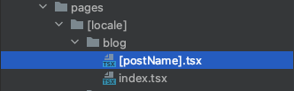

<h1 align="center">
  My personal blog
</h1>

## Table of contents
1. [Structure and implementation](#structure-and-implementation)
   1. [Multi-languages](#multi-languages)
   2. [Light/Dark themes](#lightdark-themes)
   3. [Page rendering](#page-rendering)
2. [Security issues](#security-issues)
3. [Contact and references](#contact-and-references)
4. [License](#license)

## Structure and implementation

I think, that the first thing you need to know about the blog is that is the simplest static application.
Even though there is no any API or back-end, from which posts would be fetched, you won't see
structure *page per post*. Actually, pages are actually rendered, but from JSON, and it'll be described later.

### Multi-languages

First of all, blog has been written using 3 languages (not programming ones, lol) - Polish, English and Russian.
This has been implemented using `i18n` library (quite obvious, isn't it).

In the root folder of the project you will find simple config file called
[next-i18next.config.js](next-i18next.config.js) that contains available languages and default languages:

```js
module.exports = {
  i18n: {
    defaultLocale: 'en',
    locales: ['en', 'pl', 'ru'],
  },
  react: { useSuspense: false }
};
```

In [lib](src/lib) folder, you will find a couple of function that are responsible for
the whole translation process. They will be discussed right now, but there is one more thing to mention.

In [locales](public/locales) folder, you will find a couple of other folders.
Looking at their names it is quite understood what they are responsible for.
Every folder has the same named JSON files (even the same structure) that contain
all text you see in the blog translated on 3 languages. So now you know where everything is stored,
and we can get back to [lib](src/lib) folder.

The first one is [language detector](src/lib/languageDetector.ts) contains this (`i18conifg` is an alias for [next-i18next.config.js](next-i18next.config.js)):

```ts
import languageDetector from 'next-language-detector';

import i18nextConfig from '@i18config';

export default languageDetector({
  supportedLngs: i18nextConfig.i18n.locales,
  fallbackLng: i18nextConfig.i18n.defaultLocale
});
```

The above code is just a helper for [redirect page](src/lib/redirect.tsx). It's just an
empty page that is used to check the current language:

```typescript jsx
import React from 'react';

import { useRouter } from 'next/router';

import languageDetector from './languageDetector';

const useRedirect = (to: any) => {
  const router = useRouter();
  to = to || router.asPath;

  React.useEffect(() => {
    const detectedLng = languageDetector.detect();
    if (to.startsWith('/' + detectedLng) && router.route === '/404') {
      router.replace('/' + detectedLng + router.route);
      return;
    }

    // @ts-ignore
    languageDetector.cache(detectedLng);
    router.replace('/' + detectedLng + to);
  });

  return <></>;
};

export const Redirect = () => {
  // @ts-ignore
  useRedirect();
  return <></>;
};
```

Probably you have seen, that the route of the blog always looks like that: [blog.mikhailbahdashych.com/en](blog.mikhailbahdashych.com/en).
It always starts with the picked language. You will understand why it happens just by taking a look at `pages` folder.


Content of every page outside of `[locale]` route was replaced by:

```typescript
import { Redirect } from '@lib/redirect';

export default Redirect;
```

Therefore, every time you are trying to go to wrong route you are either redirected to 404 or main route.
Also, in `_app.tsx` file, to turn on `i18n` application is exported with `appWithTranslation` wrapper:

```typescript jsx
export default appWithTranslation(App);
```

Last, but not least is [getStatic](src/lib/getStatic.ts) file which is
responsible for pages props and getting locale.

```typescript
import { serverSideTranslations } from 'next-i18next/serverSideTranslations';

import i18nextConfig from '@i18config';


export const getI18nPaths = () =>
        i18nextConfig.i18n.locales.map((lang) => ({
           params: {
              locale: lang
           }
        }));

export const getStaticPaths = () => ({
   fallback: false,
   paths: getI18nPaths()
});

export async function getI18nProps(ctx: any, ns = ['pages', 'components', 'errors', 'articles']) {
   const locale = await ctx?.params?.locale;
   const postName = await ctx?.params?.postName || null;
   const projectName = await ctx?.params?.projectName || null;

   return {
      ...(await serverSideTranslations(locale, ns)),
      locale,
      postName,
      projectName
   };
}


export function makeStaticProps(ns: string[]) {
   return async function getStaticProps(ctx: any) {
      return {
         props: await getI18nProps(ctx, ns)
      };
   };
}

```

You can see, that it returns `locale` and, optionally, `postName` or `projectName` (will be discussed [here](#page-rendering)).
It allows us to get `locale` in props and use it, for instance, in redirect function.

```typescript jsx
import { useTranslation } from 'next-i18next';
import { getStaticPaths, makeStaticProps } from '@lib/getStatic';

interface ErrorPageProps {
  locale: string;
}

const ErrorPage = ({ locale }: ErrorPageProps) => {
  const { t } = useTranslation();
  return (
    <>...</>
  );
};

const getStaticProps = makeStaticProps(['pages', 'components', 'common', 'articles']);
export { getStaticPaths, getStaticProps };

export default ErrorPage;
```

Items in array for `makeStaticProps` function have exact same names as JSON files inside locale folder.

### Light/Dark themes

Everything is quite easy here. Just `Recoil` to control the state and `localStorage` to store the value for color scheme.

```typescript
// src/store/global/global.state.ts

import { atom } from 'recoil';

export const theme = atom<'dark' | 'light'>({
  key: 'theme',
  default: 'dark',
});
```

Special hook to change the theme:

```typescript
import { useMemo } from 'react';

import { useRecoilState } from 'recoil';

import { theme as storeTheme } from '@store/global/global.state';
import { DarkTheme } from '@styles/Dark.theme';
import { LightTheme } from '@styles/Light.theme';

const useDarkMode = () => {
  const [theme, setTheme] = useRecoilState(storeTheme);

  const toggleTheme = () => {
    setTheme(theme === 'light' ? 'dark' : 'light');
  };

  const themeMode = useMemo(() => (theme === 'light' ? LightTheme : DarkTheme), [theme]);

  return [theme, toggleTheme, themeMode] as const;
};

export default useDarkMode;
```

Used in `Global.layout.tsx` by `<ThemeProvider>`:

```typescript jsx
import React from 'react';

import { ThemeProvider } from 'styled-components';

import useDarkMode from '@hooks/useDarkMode.hook';
import { DarkTheme } from '@styles/Dark.theme';
import { LightTheme } from '@styles/Light.theme';

const GlobalLayout = ({ children, loading = false }: GlobalLayoutProps) => {
  const [theme] = useDarkMode();

  return (
    <ThemeProvider theme={theme === 'light' ? LightTheme : DarkTheme}>
      ...
    </ThemeProvider>
  );
};

export default GlobalLayout;
```

Handler for theme changing has been implemented within `Header` component. 

### Page rendering

As you can see, instead of creating page per post/project only one page per entity has been created.
Every page gets the name of the project or post from params and then checks (in environmental variables) check,
if page exists it renders it from JSON, in other case it redirects user to 404. Also, it means that every JSON has to be written in certain format.

Here is how it looks like:

```typescript jsx
import React from 'react';

import { useTranslation } from 'next-i18next';
import { useRouter } from 'next/router';

import { makeStaticProps } from '@lib/getStatic';

interface PostProps {
  locale: string;
  postName: string;
}

const BlogPost = ({ locale, postName }: PostProps) => {
  const { t } = useTranslation();
  const router = useRouter();
  
  return (
    <>
       ...
       <PostParagraph
         dangerouslySetInnerHTML={{ __html: t(`articles:${postName}.content.p${index}`) }}
       />
       ...
    </>
  );
};

export const getServerSideProps = async (ctx: any) => {
  const staticProps = await makeStaticProps(['pages', 'components', 'common', 'articles']);
  const pageProps = await staticProps(ctx);
  const props = pageProps.props;

  return {
    props: {
      ...props
    }
  };
};

export default BlogPost;
```

As it's been mentioned above, the usage of props for post and project page is 
a little differ from other pages as in those case we also need to get not only 
`locale` but `postName` (or `projectName`)

Have you noticed `dangerouslySetInnerHTML`, well there is one [security issue](#security-issues)... 

## Security issues

Bruh, security issues?! Yeah, probably you have notices that every blog post is written in JSON
format, just specifying all fields and structure of the post itself, like titles, subtitles, code blocks etc.
Well, here is the XSS injection attack comes into play. Because I wanted to wrap some text
right inside the paragraph just `like this` for instance, I had to decided how I wanted to do that.

I had a couple of ideas on that, the only requirement was that every post has to be within "one-page" structure.
Basically, if you take a look at the file structure, as it has been mentioned before, you will find
that there is only one page which gets post name from the URL and then just checks (using environmental variables), 
if the page exists, it "renders" it from JSON, otherwise, it redirects to 404 page.



At this point I guess some of you already has figured out what is the issue.
If I need to render HTML that is written as text, I need to use `dangerouslySetInnerHTML` and
this is the straight road to XSS, if text comes from untrusted sources and/or not sanitized. 

```typescript jsx
<PostParagraph 
  dangerouslySetInnerHTML={{ __html: t(`articles:${postName}.content.p${index}`) }}
/>
```

```json lines
{
  "p14": "Very last step here is checking if our nginx sever is working correctly. In order to do that go to <span class='code-block'>/etc/nginx/sites-available/default</span> and paste next content (<span class='code-block'>*q</span> is our domain):",
}
```

Above you have seen an example of how I render simple paragraph. You can easily inject there 
`<script>` tag and do your dirty things. Fortunately, there is only one source, and it's trusted, and it's me :)

As I have mentioned previously, I had a couple of ideas on how to implement that.
The way it's been implemented is actually the easiest one. The other quite easy method is 
simple sanitization. The only thing that would be excluded in this case is `<script>` tag.
The exact same situation with projects page. 

The most completed is to create "your own tags" and after pages gets JSON, instead of 
rendering it at this exact moment, you would pass it to function, that would interpret your tags
to normal HTML and return it to the page. Also, it would be the sort of sanitization, as
it could be implemented right in that function. Why did I do this way? Well... You know... I'm kinda lazy :)

<h3 align="center">
  I sincerely believe that the best way to learn anything is to start teaching other people, sharing your knowledge with them. 
</h3>

<h3 align="center">
  Thank you!
</h3>

## Contact and references

- Developer contact - [contact@mikhailbahdashych.me](mailto:contact@mikhailbahdashych.me)
- Blog - [blog.mikhailbahdashych.me](https://blog.mikhailbahdashych.me)

## License

Licensed by [MIT licence](LICENSE).


